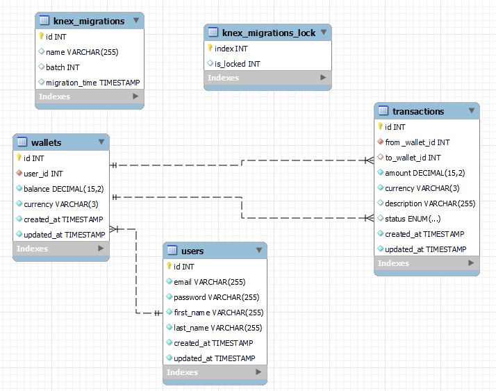

# Demo Credit

A secure digital wallet and financial services platform built with Node.js, TypeScript, and Express. This application provides wallet management, fund transfers, and integrates with Lendsqr's Karma blacklist service to prevent fraudulent activities.

## ✨ Features

- 🔒 Secure user authentication with JWT
- 💰 Digital wallet management
- 💸 Fund transfers between users
- 🏧 Withdrawal functionality
- ⚠️ Karma blacklist integration for fraud prevention
- 🛡️ Secure transaction handling
- 📝 Transaction history
- 🔄 Real-time balance updates

## 🚀 Prerequisites

- Node.js 18 or higher
- npm (comes with Node.js)
- MySQL 8.0 or higher
- Karma API credentials from Lendsqr

## 🚀 Getting Started

1. **Clone the repository**
   ```bash
   git clone <repository-url>
   cd demo-credit
   ```

2. **Install dependencies**
   ```bash
   npm install
   ```

3. **Set up environment variables**
   Copy `.env.example` to `.env` and update the values:
   ```bash
   cp .env.example .env
   ```
   
   Update the following variables in `.env`:
   ```env
   # Database Configuration
   DB_HOST=localhost
   DB_PORT=3306
   DB_USER=your_db_user
   DB_PASSWORD=your_db_password
   DB_NAME=demo_credit
   
   # JWT Configuration
   JWT_SECRET=your_jwt_secret
   
   # Karma API Configuration
   KARMA_API_KEY=your_karma_api_key
   ```

4. **Run database migrations**
   ```bash
   npx knex migrate:latest
   ```

5. **Start the development server**
   ```bash
   npm run dev
   ```

## 🛠️ Available Scripts

- `npm run build` - Compile TypeScript to JavaScript
- `npm start` - Run the compiled JavaScript in production
- `npm run dev` - Run the application using ts-node (development)
- `npm run lint` - Lint the code
- `npm run format` - Format the code using Prettier
- `npm test` - Run tests
- `npm run migrate` - Run database migrations
- `npm run migrate:rollback` - Rollback the last database migration

## ERD Diagram


## 🏗️ Project Structure

```
.
├── src/
│   ├── controllers/       # Request handlers
│   ├── middleware/        # Express middleware
│   ├── models/            # Database models
│   ├── routes/            # API route definitions
│   ├── services/          # Business logic and external services
│   ├── types/             # TypeScript type definitions
│   ├── utils/             # Utility functions
│   ├── database/          # Database configuration and migrations
│   │   └── migrations/    # Database migration files
│   └── index.ts           # Application entry point
├── tests/                 # Test files
├── .env                   # Environment variables
├── .eslintrc.json         # ESLint configuration
├── .prettierrc           # Prettier configuration
├── knexfile.ts           # Knex configuration
├── package.json          # Project configuration
└── tsconfig.json         # TypeScript configuration
```

## 🔐 Karma Blacklist Integration

The application integrates with Lendsqr's Karma blacklist service to prevent onboarding of users with records of fraudulent activities.

### How It Works

1. **During Registration**: 
   - The system checks the user's email, phone, BVN, and account number against the Karma blacklist
   - If any identifier is found in the blacklist, registration is blocked
   - A detailed error response is returned indicating the reason for rejection

2. **API Endpoint**:
   ```
   GET https://adjutor.lendsqr.com/v2/verification/karma/:identity
   ```

3. **Supported Identity Types**:
   - Email Address (e.g., test@example.com)
   - Phone Number (e.g., +2347012345678)
   - BVN (e.g., 12345678901)
   - NUBAN Account Number (e.g., 1234567890)

### Configuration

1. Set your Karma API key in `.env`:
   ```env
   KARMA_API_KEY=your_karma_api_key_here
   ```

2. The system will automatically check against the Karma service during user registration.

## 🚦 API Endpoints

### Authentication
- `POST /api/v1/register` - Register a new user
- `POST /api/v1/login` - Authenticate user

### Wallet Management
- `POST /api/v1/wallets` - Create a new wallet
- `GET /api/v1/wallets/me` - Get current user's wallet
- `POST /api/v1/wallets/fund` - Add funds to wallet
- `POST /api/v1/wallets/withdraw` - Withdraw funds from wallet
- `POST /api/v1/wallets/transfer` - Transfer funds to another user

## 🔒 Security Features

- JWT-based authentication
- Password hashing with bcrypt
- Input validation
- Rate limiting
- CORS protection
- Secure HTTP headers
- SQL injection prevention
- XSS protection


## 🙏 Acknowledgments

- [Lendsqr](https://lendsqr.com) for the Karma blacklist service

## Development

1. **Start the development server**
   ```bash
   npm run dev
   ```

2. **Build for production**
   ```bash
   npm run build
   ```

## License

ISC
